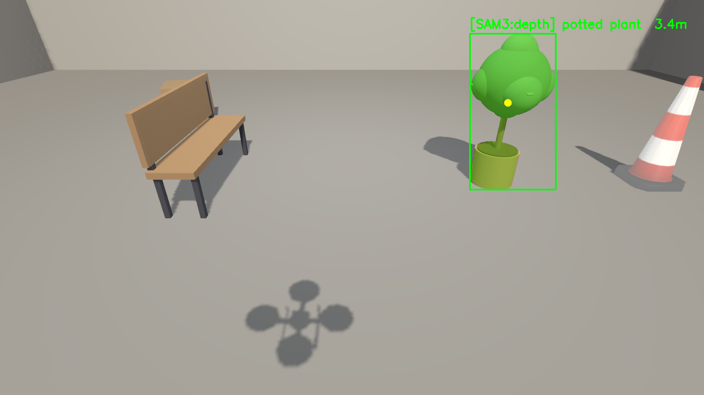
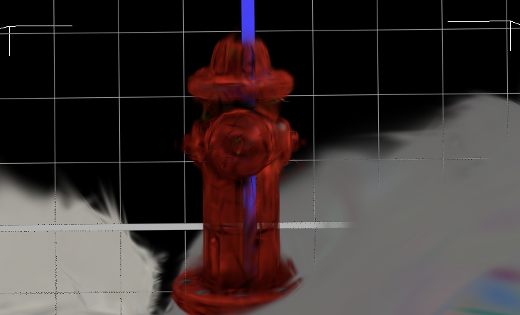
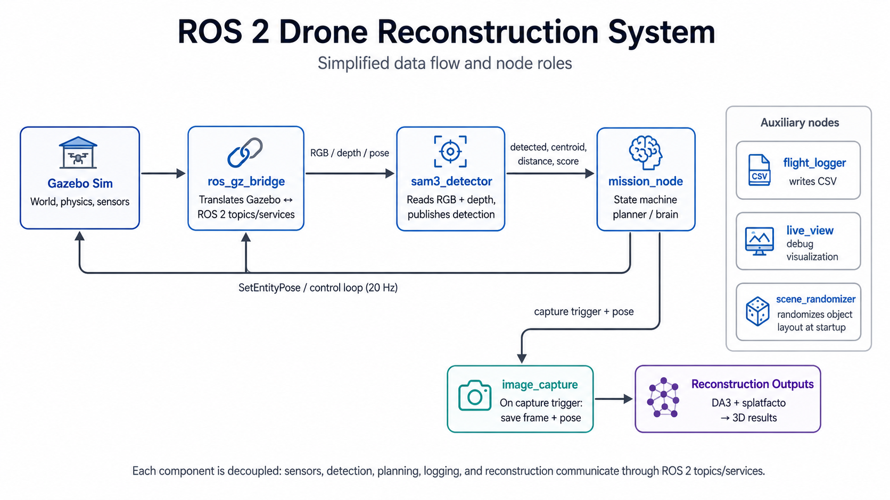
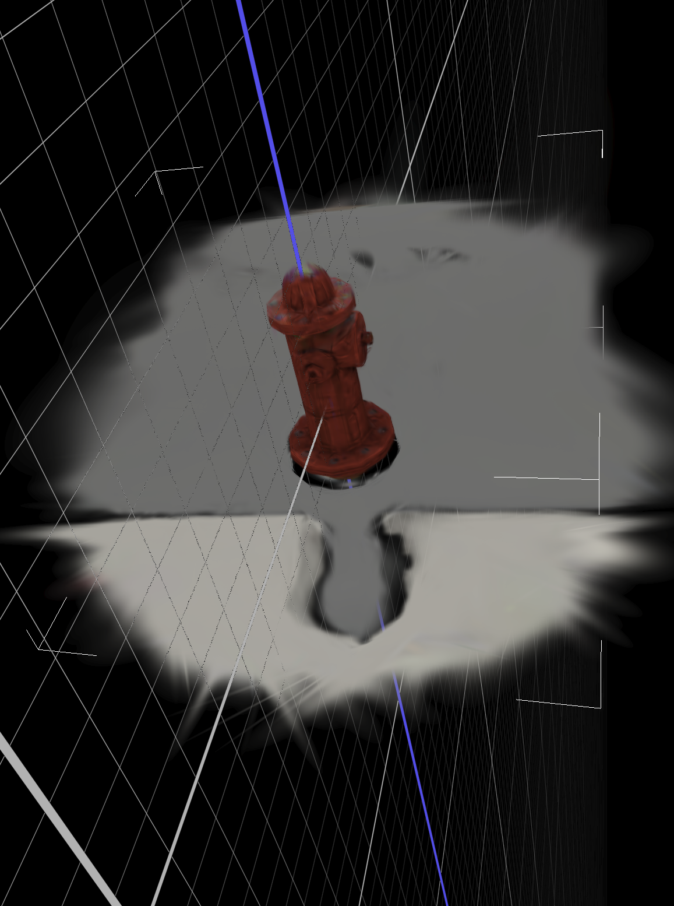
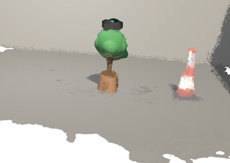
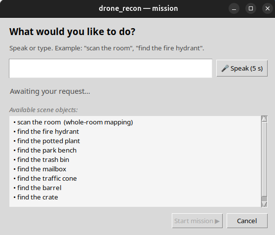
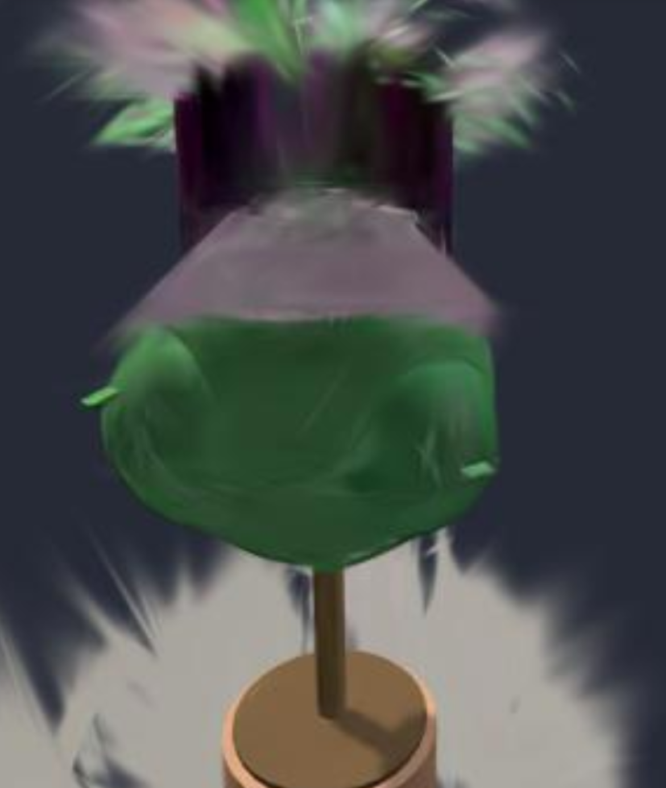

# vision-drone-inspector

> Autonomous simulated UAV inspection pipeline. A ROS 2 + Gazebo drone takes a natural-language target name (text, voice, GUI, or LLM), searches an unknown room with **SAM 3** open-vocabulary segmentation, localizes the target with **bearing-only triangulation** across multi-view detections, orbits it twice at two altitudes, and produces four 3D outputs  **Depth Anything 3** colored point cloud, Open3D Poisson mesh, and full + pruned 3D Gaussian Splatting reconstructions via splatfacto.

No fiducial markers. No target-position prior. No SLAM (simulator pose is used for vehicle self-localization in this study). The whole loop discovery, identification, orbit, reconstruction, runs in approximately 20 minutes per target on an 8 GB consumer GPU.

## What it does

Give it the name of an object. It finds it, orbits it, reconstructs it.

<table>
<tr>
<td width="50%">
  
  <br><sub><b>1. Identify.</b> SAM 3 segments the named target. Mask centroid is back-projected into a world-frame bearing ray.</sub>
</td>
<td width="50%">
  
  <br><sub><b>2. Reconstruct.</b> After two orbit rings, splatfacto trains a 3D Gaussian Splat; DA3 fuses the same views into a colored point cloud + Poisson mesh.</sub>
</td>
</tr>
</table>

## Pipeline

<p align="center">
  
</p>

Five primary ROS 2 nodes plus three auxiliaries:

| Node | Role |
|---|---|
| `mission_node` | Eight-state machine and motion planner. Owns all decisions about where the drone goes next. |
| `sam3_detector` | Hosts SAM 3 on GPU; publishes per-frame masks + bounding boxes + scores. |
| `image_capture` | Buffers the camera stream; saves frames + poses on trigger; launches reconstruction at mission end. |
| `ros_gz_bridge` | Translates between Gazebo's native transport and ROS 2 topics. |
| `scene_randomizer` | One-shot at startup. Shuffles which physical object occupies each canonical slot, so the drone has to *visually* rediscover the target on every run. |
| `flight_logger` | Per-tick CSV telemetry. |
| `live_view` | Custom OpenCV window with overlaid SAM 3 mask + state machine status bar. |

### Key technical choices

- **Bearing-only triangulation.** Each SAM 3 detection produces a world-frame unit ray. Multi-view rays are fused via a closed-form least-squares normal-equations solve `(ΣPᵢ)p* = ΣPᵢoᵢ` where `Pᵢ = I - dᵢdᵢᵀ`. The noisy depth measurement is used for fallback only, never as a triangulation input.
- **25° angular-spread gate.** The least-squares system becomes ill-conditioned when rays are near-parallel (drone flying straight, target at a fixed image position). If `θ_max < 25°` across the ray cluster, triangulation is rejected and the system falls back to a depth-projected spatial median.
- **Virtual gimbal pitch.** With a fixed 30° downward camera, ORBIT_HIGH would otherwise put the target at the bottom of the frame and let the OpenCV tracker drift to a distractor. A geometric pitch correction `θ_pitch = atan2(z_drone − z_target, R) − θ_cam` keeps the target near image-center across both orbit altitudes. Kinematic mode makes this a quaternion-only change with zero physics implications.
- **Kinematic pose control, not velocity.** The drone is driven via `SetEntityPose` writes at 20 Hz rather than `Twist` commands on `/cmd_vel`. This eliminates the 5–10 cm steady-state error a velocity controller would accumulate — the recorded pose IS the simulator pose because the planner writes it directly. Splatfacto reprojection error depends on the recorded camera pose matching the actual capture pose, so this matters. Velocity mode is implemented and remains available; it just isn't the default.

## Outputs

Every successful mission writes four PLY files to `~/recon_output/exports/`:

<table>
<tr>
<td width="33%" align="center">
  <br>
  <code>splat_pruned.ply</code><br><sub>3DGS, target only (bbox-cropped)</sub>
</td>
<td width="33%" align="center">
  <br>
  <code>scene_splat.ply</code><br><sub>3DGS, full scene</sub>
</td>
<td width="33%" align="center">
  <br>
  <code>scene_da3.ply</code><br><sub>DA3 multi-view colored point cloud</sub>
</td>
</tr>
</table>

The fourth output, `scene_mesh.ply`, is an Open3D Poisson triangle mesh derived from the DA3 point cloud. Open it in MeshLab; open the splats in [SuperSplat](https://playcanvas.com/supersplat/editor) or `ns-viewer`.

A representative set is included in [`samples/`](samples/) so you can verify the formats render correctly without running the full pipeline.

## Quick start

### Requirements

- Ubuntu 24.04 LTS
- ROS 2 Jazzy Jalisco
- Gazebo Sim Harmonic (`gz sim` 8.x)
- An NVIDIA GPU with ≥ 8 GB VRAM and a recent CUDA driver
- ~30 GB free disk (for trained splats and DA3 outputs)

### Install

```bash
# 1. clone into your ROS 2 workspace
cd ~/ros2_ws/src
git clone https://github.com/mmgallai/vision-drone-inspector.git
cd ..

# 2. build
colcon build --packages-select drone_recon
source install/setup.bash

# 3. install SAM 3, DA3, and nerfstudio (one-time)
# See docs/sam3_install.md and docs/depth_anything_3.md for step-by-step install
# of the model weights and Python venvs the pipeline expects.
```

### Run a mission

The simplest way to launch:

```bash
ros2 launch drone_recon scene1.launch.py target:="potted plant"
```

With a reproducible scene layout:

```bash
ros2 launch drone_recon scene1.launch.py target:="potted plant" seed:=42
```

Other launch arguments worth knowing:

| Argument | Default | Effect |
|---|---|---|
| `target` | (required) | The natural-language object name. SAM 3 is open-vocabulary; any phrase works that matches a scene object. |
| `seed` | `0` | Non-zero values reproduce a deterministic object-to-slot permutation. `0` means OS entropy. |
| `auto_recon` | `true` | If `false`, captures images but skips DA3 / splatfacto. Useful for re-running reconstruction with different settings. |
| `mission_mode` | `inspection` | `inspection` orbits a single target. `mapping` skips identification and does a full lawnmower sweep. |
| `control_mode` | `kinematic` | `kinematic` (recommended) or `velocity_kinematic` for `/cmd_vel`-driven flight. |

### Other ways to launch

```bash
# voice (faster-whisper transcription)
ros2 run drone_recon voice_mission

# Tkinter GUI with mic button and dropdown
ros2 run drone_recon voice_gui

# free-form natural language via Qwen 2.5 7B in Ollama
ros2 run drone_recon ai_mission
```

The Tkinter frontend looks like this:

<p align="center">
  
</p>

## Results

Localization accuracy across five canonical targets plus one moved-target stress test. All runs use `expected_target_xy = None`; the drone has zero advance knowledge of object positions and must rediscover each target visually after `scene_randomizer` shuffles the object→slot assignment.

| Target | Actual (m) | Estimated (m) | Error | SAM 3 score |
|---|---|---|---|---|
| Plant (default) | (−3.50, 1.50) | (−3.66, 1.84) | 0.36 m | 0.85 |
| Plant **(moved)** | (+2.00, −3.00) | (+1.56, −2.19) | 0.92 m | 0.91 |
| Hydrant | (0.00, 0.00) | (+0.16, −0.34) | 0.37 m | 0.94 |
| Trash bin | (+1.50, −2.00) | (+1.39, −2.18) | **0.21 m** | 0.87 |
| Mailbox | (+1.50, +2.00) | (+2.55, +2.15) | 1.06 m | 0.64 |
| Bench | (−3.50, −1.50) | (−5.40, −1.33) | 1.91 m | 0.72 |

**4 of 6** cases below 1 m, **5 of 6** at or below 1.06 m. The bench is the weakest case — long thin geometry, low parallax, weak SAM 3 score. The moved-plant test (a target relocated to a slot whose assignment was not pre-registered with the mission node) is the strongest piece of evidence that target discovery is genuinely vision-driven and not leaking a prior from the SDF.

### Failure mode that motivated the angular-spread gate

<p align="center">
  
</p>

Early on, the least-squares triangulation diverged when SAM 3 hits all arrived from a column of nearly collinear drone positions. `ΣPᵢ` became ill-conditioned and the estimate drifted toward the centroid of the ray origins — orbit-center error 1.5–2 m, splat full of floaters. The 25° angular-spread gate and the depth-projected median fallback prevented this failure mode in every subsequent test.

## Repository layout

```
vision-drone-inspector/
├── drone_recon/         # ROS 2 Python nodes (mission, SAM 3, image_capture, voice, ai_mission, …)
├── launch/              # scene1.launch.py and friends
├── scripts/             # gen_init_pointcloud.py, prune_gaussians.py, poisson_mesh.py, view_results.py
├── worlds/              # hand-authored SDF: recon_world.sdf, X3 drone model
├── config/              # mission parameters, target bounding boxes (targets.py)
├── docs/                # sam3_install.md, depth_anything_3.md, README figures
├── report/              # final report — LaTeX source + compiled PDF + figures
├── samples/             # 4 example PLY outputs from a known-good run (~70 MB)
├── test/                # pytest checks
├── package.xml          # ament_python manifest
├── setup.py             # ament_python entry points
├── LICENSE              # MIT
└── README.md            # you are here
```

## Report

The full 11-page IEEE-format writeup is in [`report/report_v2.pdf`](report/report_v2.pdf). It covers the architecture, vision pipeline, mission planner, reconstruction pipeline, scene randomization, results table, ablation, and discussion in depth. The LaTeX source ([`report/report_v2.tex`](report/report_v2.tex)) is included for anyone who wants to fork the analysis.

## Acknowledgements

This work was developed for the Intelligent Mobile Robotics course at Binghamton University. Foundation-model components used as building blocks:

- [SAM 3](https://arxiv.org/abs/2511.16719) — concept-prompted open-vocabulary segmentation
- [Depth Anything 3](https://arxiv.org/abs/2511.10647) — multi-view depth + extrinsics refinement
- [3D Gaussian Splatting](https://repo-sam.inria.fr/fungraph/3d-gaussian-splatting/) via [nerfstudio](https://docs.nerf.studio/) `splatfacto`
- [Open3D](https://www.open3d.org/) for Poisson surface reconstruction
- [ROS 2 Jazzy](https://docs.ros.org/en/jazzy/) and [Gazebo Sim Harmonic](https://gazebosim.org/) for middleware and simulation

## License

MIT — see [`LICENSE`](LICENSE).
